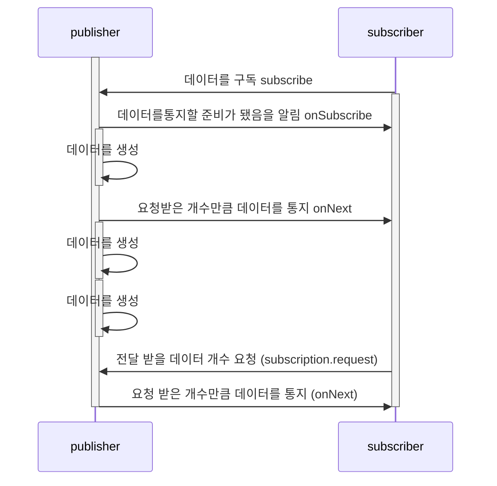

## reactive stream 이란??

- 리액티브 프로그래밍의 라이브러리의 표준 사양
- RxJava는 이 Reactive Streams의 인터페이스들을 구현한 구현체
- reactive streams는 publisher, subscriber, subscription, processor 로 구성
    - https://github.com/reactive-streams/reactive-streams-jvm
    - publisher: 데이터를 생성하고 통지 (생산자)
    - subscriber: 통지된 데이터를 전달받아서 전달한다. (구독자)
    - subscription: 전달 받을 데이터의 개수를 요청하고 구독을 해지한다.
    - processor: publisher와 subscriber의 기능이 모두 존재

- cold publisher
    - 생산자는 소비자가 구독 할때마다 데이터를 처음부터 새로 통지
    - 데이터를 통지하는 새로운 타임 라인이 생성
    - 소비자는 구독 시점과 상관없이 통지된 데이터를 처음부터 받을 수 있음
- hot publisher
    - 생산자는 소비자 수와 상관없이 데이터를 한번만 통지
    - 데이터를 통지하는 타임라인은 `하나`
    - 소비자는 발행된 데이터를 처음부터 전달 받는게 아니라 구독한 시점에 통지된 데이터들만 전달 받을 수 있다.